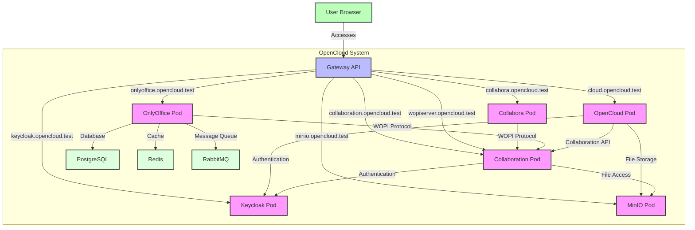

# OpenCloud Helm Charts

Welcome to the **OpenCloud Helm Charts** repository! This repository is intended as a community-driven space for developing and maintaining Helm charts for deploying OpenCloud on Kubernetes.

## 📑 Table of Contents

- [About](#-about)
- [Community](#-community)
- [Contributing](#-contributing)
- [Prerequisites](#prerequisites)
- [Installing the Helm Charts](#-installing-the-helm-charts)
- [Architecture](#architecture)
  - [Component Interaction Diagram](#component-interaction-diagram)
- [Authentication](#authentication)
  - [Authentication Modes](#authentication-modes)
  - [External OIDC Providers](#external-oidc-providers)
- [Configuration](#configuration)
  - [Global Settings](#global-settings)
  - [Image Settings](#image-settings)
  - [OpenCloud Settings](#opencloud-settings)
  - [Keycloak Settings](#keycloak-settings)
  - [PostgreSQL Settings](#postgresql-settings)
  - [OnlyOffice Settings](#onlyoffice-settings)
  - [Collabora Settings](#collabora-settings)
  - [Collaboration Service Settings](#collaboration-service-settings)
- [Gateway API Configuration](#gateway-api-configuration)
  - [HTTPRoute Settings](#httproute-settings)
- [Setting Up Gateway API with Talos, Cilium, and cert-manager](#setting-up-gateway-api-with-talos-cilium-and-cert-manager)
- [Development Chart](#-development-chart)
- [License](#-license)
- [Community Maintained](#community-maintained)

## 🚀 About

This repository is created to **welcome contributions from the community**. It does not contain official charts from OpenCloud GmbH and is **not officially supported by OpenCloud GmbH**. Instead, these charts are maintained by the open-source community.

OpenCloud is a cloud collaboration platform that provides file sync and share, document collaboration, and more. This Helm chart deploys OpenCloud with Keycloak for authentication, MinIO for object storage, and multiple options for document editing including Collabora and OnlyOffice.

## 💬 Community

Join our Matrix chat for discussions about OpenCloud Helm Charts:
- [OpenCloud Helm on Matrix](https://matrix.to/#/%23opencloud-helm:matrix.org)

For general OpenCloud discussions:
- [OpenCloud on Matrix](https://matrix.to/#/%23opencloud:matrix.org)
- [OpenCloud on Mastodon](https://social.opencloud.eu/@OpenCloud)
- [GitHub Discussions](https://github.com/orgs/opencloud-eu/discussions)

## 💡 Contributing

We encourage contributions from the community! If you'd like to contribute:
- Fork this repository
- Submit a Pull Request
- Discuss and collaborate on issues

Please ensure that your PR follows best practices and includes necessary documentation.

## Prerequisites

- Kubernetes 1.19+
- Helm 3.2.0+
- PV provisioner support in the underlying infrastructure (if persistence is enabled)
- External ingress controller (e.g., Cilium Gateway API) for routing traffic to the services

## 📦 Installation

To install the chart with the release name `opencloud`:

```bash
# Navigate to the chart directory first
cd /path/to/helm-repo/charts/opencloud

# Then run the installation command
helm install opencloud . \
  --namespace opencloud \
  --create-namespace \
  --set httpRoute.enabled=true \
  --set httpRoute.gateway.name=opencloud-gateway \
  --set httpRoute.gateway.namespace=kube-system
```

Alternatively, from the repository root:

```bash
helm install opencloud ./charts/opencloud \
  --namespace opencloud \
  --create-namespace \
  --set httpRoute.enabled=true \
  --set httpRoute.gateway.name=opencloud-gateway \
  --set httpRoute.gateway.namespace=kube-system
```

## Architecture

This Helm chart deploys the following components:

1. **OpenCloud** - Main application (fork of ownCloud Infinite Scale)
2. **Keycloak** - Authentication provider with OpenID Connect
3. **PostgreSQL** - Database for Keycloak and OnlyOffice
4. **MinIO** - S3-compatible object storage
5. **Collabora** - Online document editor (CODE - Collabora Online Development Edition)
6. **OnlyOffice** - Alternative document editor with real-time collaboration
7. **Collaboration Service** - WOPI server that connects OpenCloud with document editors
8. **Redis** - Cache for OnlyOffice
9. **RabbitMQ** - Message queue for OnlyOffice

All services are deployed with `ClusterIP` type, which means they are only accessible within the Kubernetes cluster. You need to configure your own ingress controller (e.g., Cilium Gateway API) to expose the services externally.

## Authentication

OpenCloud supports three authentication modes, providing flexibility for different deployment scenarios.

### Authentication Modes

1. **Built-in Keycloak** (default) - Deploys and configures Keycloak automatically
   - Fully managed authentication system
   - Pre-configured with OpenCloud realm
   - Suitable for standalone deployments

2. **External OIDC Provider** - Use Auth0, Okta, Azure AD, Google, or any OIDC-compliant provider
   - Provider-agnostic configuration
   - Integration with existing identity infrastructure
   - Detailed configuration options for claims, scopes, and role mapping

3. **Internal IDP** - Use OpenCloud's built-in identity provider
   - Activated when both Keycloak and external OIDC are disabled
   - Lightweight authentication for testing/development
   - No external dependencies

### External OIDC Providers

For detailed information on configuring external OIDC providers, including provider-specific examples and troubleshooting, see:

📘 **[External OIDC Provider Configuration Guide](docs/EXTERNAL-OIDC.md)**

The guide includes ready-to-use configurations for:
- Auth0
- Okta
- Azure AD (Microsoft Entra ID)
- Google Identity Platform
- GitLab
- External Keycloak instances

Quick example using Auth0:

```yaml
global:
  oidc:
    enabled: true
    issuer: "https://yourdomain.auth0.com"
    clientId: "your-client-id"
    userClaim: "email"
    roleClaim: "https://yourdomain.com/roles"

keycloak:
  internal:
    enabled: false
```

### Component Interaction Diagram

The following diagram shows how the different components interact with each other:



Key interactions:

1. **User to Gateway**: 
   - Users access all services through the Gateway API using different hostnames

2. **OpenCloud Pod**:
   - Main application that users interact with
   - Authenticates users via Keycloak
   - Stores files in MinIO
   - Communicates with Collaboration service for collaborative editing

3. **Collabora Pod**:
   - Office document editor
   - Connects to the Collaboration pod via WOPI protocol
   - Uses token server secret for authentication

4. **OnlyOffice Pod**:
   - Alternative office document editor
   - Connects to the Collaboration pod via WOPI protocol
   - Uses PostgreSQL for database storage
   - Uses Redis for caching
   - Uses RabbitMQ for message queuing
   - Provides real-time collaborative editing

5. **Collaboration Pod**:
   - Implements WOPI server functionality
   - Acts as intermediary between document editors and file storage
   - Handles collaborative editing sessions
   - Accesses files from MinIO

6. **Keycloak Pod**:
   - Handles authentication for all services
   - Manages user identities and permissions

7. **MinIO Pod**:
   - Object storage for all files
   - Accessed by OpenCloud and Collaboration pods

## Configuration

The following table lists the configurable parameters of the OpenCloud chart and their default values.

### Using Private Registries

The chart supports using private container registries through global overrides. This is useful for:
- Air-gapped environments
- Corporate registry mirrors
- Pull-through caches

To use a private registry for all images:

```bash
helm install opencloud ./charts/opencloud \
  --set global.image.registry=my-registry.com \
  --set global.image.pullPolicy=Always
```

This will prepend `my-registry.com/` to all image references in the chart. For example:
- `keycloak/keycloak:26.1.4` becomes `my-registry.com/keycloak/keycloak:26.1.4`
- `opencloudeu/opencloud-rolling:latest` becomes `my-registry.com/opencloudeu/opencloud-rolling:latest`

### Global Settings

| Parameter | Description | Default |
| --------- | ----------- | ------- |
| `namespace` | Deprecated: Namespace is now controlled by Helm (.Release.Namespace) | (removed) |
| `global.domain.opencloud` | Domain for OpenCloud | `cloud.opencloud.test` |
| `global.domain.keycloak` | Domain for Keycloak | `keycloak.opencloud.test` |
| `global.domain.minio` | Domain for MinIO | `minio.opencloud.test` |
| `global.domain.collabora` | Domain for Collabora | `collabora.opencloud.test` |
| `global.domain.onlyoffice` | Domain for OnlyOffice | `onlyoffice.opencloud.test` |
| `global.domain.companion` | Domain for Companion | `companion.opencloud.test` |
| `global.domain.wopi` | Domain for WOPI server | `wopiserver.opencloud.test` |
| `global.tls.enabled` | Enable TLS (set to false when using gateway TLS termination externally) | `false` |
| `global.tls.secretName` | secretName for TLS certificate | `""` |
| `global.oidc.enabled` | Enable external OIDC provider (disables automatic Keycloak configuration) | `false` |
| `global.oidc.issuer` | OIDC provider base URL (required when oidc.enabled=true) | `""` |
| `global.oidc.clientId` | OIDC client/application ID | `"web"` |
| `global.oidc.accountUrl` | URL for user account management (optional) | `""` |
| `global.oidc.scopes` | OAuth 2.0 scopes to request (optional) | `""` |
| `global.oidc.userClaim` | Token claim for user identification (optional) | `""` |
| `global.oidc.autoProvision` | Auto-create users on first login (optional) | `true` |
| `global.oidc.roleDriver` | Role assignment method: "oidc" or "default" (optional) | `""` |
| `global.oidc.roleClaim` | Token claim containing user roles (optional) | `""` |
| `global.storage.storageClass` | Storage class for persistent volumes | `""` |
| `global.image.registry` | Global registry override for all images (e.g., `my-registry.com`) | `""` |
| `global.image.pullPolicy` | Global pull policy override for all images (`Always`, `IfNotPresent`, `Never`) | `""` |

> 💡 **Note on OIDC Configuration**: When using external OIDC (`global.oidc.enabled: true`), the internal Keycloak's automatic configuration is bypassed. See the [External OIDC Provider Configuration Guide](docs/EXTERNAL-OIDC.md) for detailed setup instructions.

### Image Settings

| Parameter | Description | Default |
| --------- | ----------- | ------- |
| `image.registry` | OpenCloud image registry | `docker.io` |
| `image.repository` | OpenCloud image repository | `opencloudeu/opencloud-rolling` |
| `image.tag` | OpenCloud image tag | `latest` |
| `image.pullPolicy` | Image pull policy | `IfNotPresent` |
| `image.pullSecrets` | Image pull secrets | `[]` |

### Service Account Settings

| Parameter | Description | Default |
| --------- | ----------- | ------- |
| `serviceAccount.create` | Specifies whether a service account should be created | `true` |
| `serviceAccount.annotations` | Annotations to add to the service account | `{}` |
| `serviceAccount.name` | The name of the service account to use (auto-generated if not set) | `""` |

### OpenCloud Settings

#### Core Settings

| Parameter | Description | Default |
| --------- | ----------- | ------- |
| `opencloud.enabled` | Enable OpenCloud | `true` |
| `opencloud.replicas` | Number of replicas (Note: When using multiple replicas, persistence should be disabled or use a storage class that supports ReadWriteMany access mode) | `1` |
| `opencloud.existingSecret` | Name of the existing secret for admin credentials | `""` |
| `opencloud.adminPassword` | Admin password | `admin` |
| `opencloud.createDemoUsers` | Create demo users | `false` |
| `opencloud.additionalServices` | Additional OpenCloud services to start | `[]` |
| `opencloud.excludeServices` | Services to exclude from starting (automatically managed) | `[]` |
| `opencloud.extraEnv` | Additional environment variables (array) | `[]` |
| `opencloud.extraEnvFrom` | Additional environment variables from ConfigMaps/Secrets | `[]` |
| `opencloud.resources` | CPU/Memory resource requests/limits | See values.yaml |
| `opencloud.nodeSelector` | Node selector for pod assignment | `{}` |
| `opencloud.tolerations` | Tolerations for pod assignment | `[]` |
| `opencloud.affinity` | Affinity rules for pod assignment | `{}` |
| `opencloud.podAnnotations` | Additional pod annotations | `{}` |
| `opencloud.podLabels` | Additional pod labels | `{}` |
| `opencloud.terminationGracePeriodSeconds` | Termination grace period | `30` |
| `opencloud.dnsPolicy` | DNS policy for the pod | `ClusterFirst` |
| `opencloud.persistence.config.enabled` | Enable config persistence | `true` |
| `opencloud.persistence.config.size` | Size of config persistent volume | `5Gi` |
| `opencloud.persistence.data.enabled` | Enable data persistence | `true` |
| `opencloud.persistence.data.size` | Size of data persistent volume | `30Gi` |

> 📝 **Note**: The `excludeServices` list is automatically managed. When using external OIDC or Keycloak, the `idp` service is automatically excluded. When using external NATS, the `nats` service is excluded.

#### Environment Configuration (`config.env`)

Application settings configured via environment variables:

| Parameter | Description | Default |
| --------- | ----------- | ------- |
| `opencloud.config.env.log.level` | Log level (debug, info, warn, error) | `info` |
| `opencloud.config.env.log.color` | Enable colored log output | `false` |
| `opencloud.config.env.log.pretty` | Enable pretty-printed JSON logs | `false` |
| `opencloud.config.env.insecure` | Insecure mode (for self-signed certificates) | `true` |
| `opencloud.config.env.graph.availableRoles` | Available OpenCloud unified role UUIDs | See values.yaml |
| `opencloud.config.env.graph.assignDefaultUserRole` | Auto-assign default user role | `false` |
| `opencloud.config.env.graph.usernameMatch` | Username matching strategy (none, email, username) | `none` |
| `opencloud.config.env.proxy.tls` | Use TLS between proxy and OpenCloud services | `false` |
| `opencloud.config.env.proxy.enableBasicAuth` | Enable basic authentication | `false` |
| `opencloud.config.env.proxy.autoprovisionAccounts` | Auto-provision user accounts from OIDC | `true` |
| `opencloud.config.env.proxy.roleAssignmentDriver` | Role assignment driver (oidc, default) | `oidc` |
| `opencloud.config.env.proxy.oidc.rewriteWellknown` | Rewrite OIDC well-known endpoint | `true` |
| `opencloud.config.env.proxy.oidc.userOidcClaim` | OIDC claim for user identification | `preferred_username` |
| `opencloud.config.env.proxy.oidc.userCs3Claim` | CS3 claim for user identification | `username` |
| `opencloud.config.env.proxy.oidc.roleAssignmentClaim` | OIDC claim containing user roles | `roles` |
| `opencloud.config.env.proxy.oidc.accessTokenVerifyMethod` | Access token verification method | `jwt` |
| `opencloud.config.env.frontend.readonlyUserAttributes` | Read-only user attributes (managed by IDP) | See values.yaml |
| `opencloud.config.env.web.oidcScope` | OIDC scope to request | `openid profile email groups roles` |
| `opencloud.config.env.sharing.publicShareMustHavePassword` | Require password for public shares | `false` |
| `opencloud.config.env.passwordPolicy.bannedPasswordsFile` | Banned passwords list filename | `banned-password-list.txt` |
| `opencloud.config.env.gateway.grpcAddr` | Gateway gRPC address | `0.0.0.0:9142` |
| `opencloud.config.env.search.extractorType` | Search extractor type (tika, basic) | `tika` |
| `opencloud.config.env.grpc.maxReceivedMessageSize` | Maximum gRPC message size (bytes) | `102400000` |
| `opencloud.config.env.admin.userId` | Admin user ID (empty for default) | `""` |

#### File Configuration (`config.files`)

Complex settings configured via ConfigMap files:

| Parameter | Description | Default |
| --------- | ----------- | ------- |
| `opencloud.config.files.theme` | Web UI theme name | `owncloud` |
| `opencloud.config.files.appRegistry` | App registry configuration (YAML object) | `{}` (uses default) |
| `opencloud.config.files.csp` | Content Security Policy configuration (YAML object) | `{}` (uses default) |
| `opencloud.config.files.proxy` | Advanced proxy configuration with role mappings (YAML object) | `{}` |
| `opencloud.config.files.bannedPasswordList` | Multi-line list of banned passwords | `""` (uses default) |

> 💡 **Tip**: For most use cases, the environment configuration (`config.env`) is sufficient. File configuration (`config.files`) is for advanced scenarios requiring complex YAML structures.

#### SMTP Configuration

Email notification settings:

| Parameter | Description | Default |
| --------- | ----------- | ------- |
| `opencloud.smtp.enabled` | Enable SMTP for email notifications | `false` |
| `opencloud.smtp.host` | SMTP server hostname | `""` |
| `opencloud.smtp.port` | SMTP server port | `587` |
| `opencloud.smtp.sender` | Email sender address | `""` (auto-generated) |
| `opencloud.smtp.existingSecret` | Name of existing secret with SMTP credentials | `""` |
| `opencloud.smtp.username` | SMTP username (ignored if existingSecret is set) | `""` |
| `opencloud.smtp.password` | SMTP password (ignored if existingSecret is set) | `""` |
| `opencloud.smtp.insecure` | Allow insecure SMTP connections | `false` |
| `opencloud.smtp.authentication` | SMTP authentication method (plain, login, none) | `plain` |
| `opencloud.smtp.encryption` | SMTP encryption (starttls, tls, none) | `starttls` |

### OpenCloud Storage Settings

| Parameter | Description | Default |
| --------- | ----------- | ------- |
| `opencloud.storage.mode` | Storage backend (s3 or posixfs) | `s3` |

### OpenCloud S3 Storage Settings

The following options configure S3 for user file storage, either with the internal MinIO instance or with an external S3 provider.

| Parameter | Description | Default |
| --------- | ----------- | ------- |
| `opencloud.storage.s3.internal.enabled` | Enable internal MinIO instance | `true` |
| `opencloud.storage.s3.internal.existingSecret` | Name of the existing secret | `` |
| `opencloud.storage.s3.internal.rootUser` | MinIO root user | `opencloud` |
| `opencloud.storage.s3.internal.rootPassword` | MinIO root password | `opencloud-secret-key` |
| `opencloud.storage.s3.internal.bucketName` | MinIO bucket name | `opencloud-bucket` |
| `opencloud.storage.s3.internal.region` | MinIO region | `default` |
| `opencloud.storage.s3.internal.resources` | CPU/Memory resource requests/limits | See values.yaml |
| `opencloud.storage.s3.internal.persistence.enabled` | Enable MinIO persistence | `true` |
| `opencloud.storage.s3.internal.persistence.existingClaim` | Name of existing PVC instead of the settings below | `` |
| `opencloud.storage.s3.internal.persistence.size` | Size of the MinIO persistent volume | `30Gi` |
| `opencloud.storage.s3.internal.persistence.storageClass` | MinIO storage class | `""` |
| `opencloud.storage.s3.internal.persistence.accessMode` | MinIO access mode | `ReadWriteOnce` |
| `opencloud.storage.s3.external.enabled` | Enable external S3 | `false` |
| `opencloud.storage.s3.external.endpoint` | External S3 endpoint URL | `""` |
| `opencloud.storage.s3.external.region` | External S3 region | `default` |
| `opencloud.storage.s3.external.existingSecret` | Name of the existing secret | `` |
| `opencloud.storage.s3.external.accessKey` | External S3 access key | `""` |
| `opencloud.storage.s3.external.secretKey` | External S3 secret key | `""` |
| `opencloud.storage.s3.external.bucket` | External S3 bucket | `""` |
| `opencloud.storage.s3.external.createBucket` | Create bucket if it doesn't exist | `true` |

### OpenCloud PosixFS Storage Settings

The following options allow setting up a POSIX-compatible filesystem (such as NFS or CephFS) for user file storage instead of S3. This is useful for environments where object storage is not available or not desired.

| Parameter | Description | Default |
| --------- | ----------- | ------- |
| `opencloud.storage.posixfs.idCacheStore` | Cache store, between 'memory', 'redis-sentinel', 'nats-js-kv', 'noop' | `nats-js-kv` |
| `opencloud.storage.posixfs.rootPath` | Path of storage root directory in openCloud pod | `/var/lib/opencloud/storage` |
| `opencloud.storage.posixfs.persistence.enabled` | Enable persistence for PosixFS | `true` |
| `opencloud.storage.posixfs.persistence.existingClaim` | Name of existing PVC instead of the settings below | `""` |
| `opencloud.storage.posixfs.persistence.size` | Size of the PosixFS persistent volume | `30Gi` |
| `opencloud.storage.posixfs.persistence.storageClass` | Storage class for PosixFS volume | `""` |
| `opencloud.storage.posixfs.persistence.accessMode` | Access mode for PosixFS volume | `ReadWriteMany` |

**Note:** When using `posixfs` mode, ensure that the underlying storage supports the required access mode (e.g., `ReadWriteMany` for multiple replicas). The underlying filesystem must support `flock` and `xattrs` so for NFS the minimum version is 4.2.

⚠️ **Important**: PosixFS requires exclusive filesystem access in non-collaborative mode (default).
Do not modify files directly while OpenCloud is running!

For details see: [OpenCloud PosixFS Documentation](https://docs.opencloud.eu/docs/admin/configuration/storage/storage-posix/)

### NATS Messaging Configuration

| Parameter  | Description | Default |
| ---------- | ----------- | ------- |
| `opencloud.nats.external.enabled` | Use an external NATS server (required for high availability) | `false` |
| `opencloud.nats.external.endpoint` | Endpoint of the external NATS server | `nats.opencloud-nats.svc.cluster.local:4222` |
| `opencloud.nats.external.cluster` | NATS cluster name | `opencloud-cluster` |
| `opencloud.nats.external.tls.enabled` | Enable TLS for communication with NATS | `false` |
| `opencloud.nats.external.tls.certTrusted` | Set to `false` if the external NATS server's certificate is not trusted by default (e.g. self-signed) | `true` |
| `opencloud.nats.external.tls.insecure` | Disable certificate validation (not recommended for production) | `false` |
| `opencloud.nats.external.tls.caSecretName` | Name of the Kubernetes Secret containing the CA certificate (only required if `certTrusted` is `false`) | `opencloud-nats-ca` |

> 💡 The secret referenced by `caSecretName` **must contain a key named `ca.crt`** with the root CA certificate used to verify the external NATS server.
> Example:
>
> ```bash
> kubectl create secret generic opencloud-nats-ca \
>   --from-file=ca.crt=./path/to/nats-ca.pem \
>   --namespace your-namespace
> ```

### Keycloak Settings

OpenCloud supports three authentication modes. By default, the chart deploys an internal Keycloak instance. You can also use an external OIDC provider (Auth0, Okta, Azure AD, etc.) or OpenCloud's internal IDP (when both are disabled).

For detailed external OIDC configuration, see the [External OIDC Provider Configuration Guide](docs/EXTERNAL-OIDC.md).

#### Internal Keycloak

| Parameter | Description | Default |
| --------- | ----------- | ------- |
| `keycloak.internal.enabled` | Enable internal Keycloak deployment | `true` |
| `keycloak.internal.image.repository` | Keycloak image repository | `quay.io/keycloak/keycloak` |
| `keycloak.internal.image.tag` | Keycloak image tag | `26.1.4` |
| `keycloak.internal.image.pullPolicy` | Image pull policy | `IfNotPresent` |
| `keycloak.internal.replicas` | Number of replicas | `1` |
| `keycloak.internal.existingSecret` | Name of the existing secret | `""` |
| `keycloak.internal.adminUser` | Admin user | `admin` |
| `keycloak.internal.adminPassword` | Admin password | `admin` |
| `keycloak.internal.realm` | Realm name | `openCloud` |
| `keycloak.internal.resources` | CPU/Memory resource requests/limits | `{}` |
| `keycloak.internal.cors.enabled` | Enable CORS | `true` |
| `keycloak.internal.cors.allowAllOrigins` | Allow all origins | `true` |

> **Note**: When using internal Keycloak with multiple OpenCloud replicas (`opencloud.replicas > 1`), you must use an external shared database or LDAP. The embedded IDM does not support replication. See [issue #53](https://github.com/opencloud-eu/helm/issues/53) for details.

#### Authentication Mode Examples

**Using Built-in Keycloak (Default)**:
```yaml
keycloak:
  internal:
    enabled: true  # This is the default
```

**Using External OIDC Provider (e.g., Okta)**:
```yaml
global:
  oidc:
    enabled: true
    issuer: "https://yourorg.okta.com/oauth2/default"
    clientId: "opencloud-client"

keycloak:
  internal:
    enabled: false
```

**Using Internal IDP** (no external authentication):
```yaml
global:
  oidc:
    enabled: false

keycloak:
  internal:
    enabled: false  # OpenCloud's internal IDP will be used
```

### PostgreSQL Settings

| Parameter | Description | Default |
| --------- | ----------- | ------- |
| `postgres.enabled` | Enable PostgreSQL | `true` |
| `postgres.database` | Database name | `keycloak` |
| `postgres.existingSecret` | Name of the existing secret | `` |
| `postgres.user` | Database user | `keycloak` |
| `postgres.password` | Database password | `keycloak` |
| `postgres.resources` | CPU/Memory resource requests/limits | `{}` |
| `postgres.persistence.enabled` | Enable persistence | `true` |
| `postgres.persistence.size` | Size of the persistent volume | `1Gi` |
| `postgres.persistence.storageClass` | Storage class | `""` |
| `postgres.persistence.accessMode` | Access mode | `ReadWriteOnce` |


### OnlyOffice Settings

| Parameter | Description | Default |
| --------- | ----------- | ------- |
| `onlyoffice.enabled` | Enable OnlyOffice | `true` |
| `onlyoffice.repository` | OnlyOffice image repository | `onlyoffice/documentserver` |
| `onlyoffice.tag` | OnlyOffice image tag | `8.2.2` |
| `onlyoffice.pullPolicy` | Image pull policy | `IfNotPresent` |
| `onlyoffice.wopi.enabled` | Enable WOPI integration | `true` |
| `onlyoffice.useUnauthorizedStorage` | Use unauthorized storage (for self-signed certificates) | `true` |
| `onlyoffice.persistence.enabled` | Enable persistence | `true` |
| `onlyoffice.persistence.size` | Size of the persistent volume | `2Gi` |
| `onlyoffice.resources` | CPU/Memory resource requests/limits | `{}` |
| `onlyoffice.config.coAuthoring.secret.existingSecret` | Name of the existing secret | `` |
| `onlyoffice.config.coAuthoring.secret.session.string` | Session string for onlyoffice | `` |
| `onlyoffice.collaboration.enabled` | Enable collaboration service | `true` |

If you use Traefik and enable OnlyOffice, this chart will automatically create a `Middleware`
named `add-x-forwarded-proto-https`, used by:
* Ingress (if `annotationsPreset: traefik`)
* Gateway API `HTTPRoute` (if `gateway.className: traefik`)

This ensures the `X-Forwarded-Proto: https` header is added as required by OnlyOffice.

### Collabora Settings

| Parameter | Description | Default |
| --------- | ----------- | ------- |
| `collabora.enabled` | Enable Collabora | `true` |
| `collabora.image.repository` | Collabora image repository | `collabora/code` |
| `collabora.image.tag` | Collabora image tag | `24.04.13.2.1` |
| `collabora.image.pullPolicy` | Image pull policy | `IfNotPresent` |
| `collabora.existingSecret` | Name of the existing secret | `` |
| `collabora.admin.username` | Admin username | `admin` |
| `collabora.admin.password` | Admin password | `admin` |
| `collabora.ssl.enabled` | Enable SSL | `true` |
| `collabora.ssl.verification` | SSL verification | `true` |
| `collabora.resources` | CPU/Memory resource requests/limits | `{}` |

### Collaboration Service Settings

| Parameter | Description | Default |
| --------- | ----------- | ------- |
| `collaboration.enabled` | Enable collaboration service | `true` |
| `collaboration.resources` | CPU/Memory resource requests/limits | `{}` |

## Ingress Configuration

This chart supports standard Kubernetes Ingress resources for exposing services. For environments requiring specific ingress controller features, annotation presets are available.

### Ingress Settings

| Parameter | Description | Default |
| --------- | ----------- | ------- |
| `ingress.enabled` | Enable Ingress resources | `false` |
| `ingress.ingressClassName` | Ingress class name (e.g., nginx, traefik) | `""` |
| `ingress.annotationsPreset` | Preset for ingress controller annotations | `""` |
| `ingress.annotations` | Custom annotations for all ingress resources | `{}` |

### Annotation Presets

The `annotationsPreset` parameter helps configure ingress controller-specific features, particularly for OnlyOffice which requires the X-Forwarded-Proto header:

- `nginx` - Uses configuration snippets to inject headers
- `nginx-no-snippets` - For environments where snippets are forbidden (e.g., Rackspace)
- `traefik` - Creates required Middleware resources
- `haproxy` - Uses HAProxy-specific header injection
- `contour` - Uses Contour request headers
- `istio` - Uses Istio EnvoyFilter

Example for Rackspace or security-restricted environments:
```yaml
ingress:
  enabled: true
  ingressClassName: nginx
  annotationsPreset: nginx-no-snippets
```

## Gateway API Configuration

This chart includes HTTPRoute resources that can be used to expose the OpenCloud, Keycloak, and MinIO services externally. The HTTPRoutes are configured to route traffic to the respective services.

### HTTPRoute Settings

| Parameter | Description | Default |
| --------- | ----------- | ------- |
| `httpRoute.enabled` | Enable HTTPRoutes | `true` |
| `httpRoute.gateway.name` | Gateway name | `opencloud-gateway` |
| `httpRoute.gateway.namespace` | Gateway namespace | `""` (defaults to Release.Namespace) |
| `httpRoute.gateway.sectionName` | Gateway section name | `""` (defaults to multiple route-specific section names for the routes listed below) |

The following HTTPRoutes are created when `httpRoute.enabled` is set to `true`:

1. **OpenCloud HTTPRoute**:
   - Hostname: `global.domain.opencloud`
   - Service: `{{ release-name }}-opencloud`
   - Port: 9200
   - Headers: Removes Permissions-Policy header to prevent browser console errors

2. **Keycloak HTTPRoute** (when `keycloak.internal.enabled` is `true`):
   - Hostname: `global.domain.keycloak`
   - Service: `{{ release-name }}-keycloak`
   - Port: 8080
   - Headers: Adds Permissions-Policy header to prevent browser features like interest-based advertising

3. **MinIO HTTPRoute** (when `opencloud.storage.mode` is `s3` and `opencloud.storage.s3.internal.enabled` is `true`):
   - Hostname: `global.domain.minio`
   - Service: `{{ release-name }}-minio`
   - Port: 9001
   - Headers: Adds Permissions-Policy header to prevent browser features like interest-based advertising

   default user: opencloud
   pass: opencloud-secret-key

4. **OnlyOffice HTTPRoute** (when `onlyoffice.enabled` is `true`):
   - Hostname: `global.domain.onlyoffice`
   - Service: `{{ release-name }}-onlyoffice`
   - Port: 80
   - Path: "/"
   - This route is used to access the OnlyOffice Document Server for collaborative editing

5. **WOPI HTTPRoute** (when `onlyoffice.collaboration.enabled` and `onlyoffice.enabled` are `true`):
   - Hostname: `global.domain.wopi`
   - Service: `{{ release-name }}-collaboration`
   - Port: 9300
   - Path: "/"
   - This route is used for the WOPI protocol communication between OnlyOffice and the collaboration service

6. **Collabora HTTPRoute** (when `collabora.enabled` is `true`):
   - Hostname: `global.domain.collabora`
   - Service: `{{ release-name }}-collabora`
   - Port: 9980
   - Headers: Adds Permissions-Policy header to prevent browser features like interest-based advertising

7. **Collaboration (WOPI) HTTPRoute** (when `collaboration.enabled` is `true`):
   - Hostname: `global.domain.wopi`
   - Service: `{{ release-name }}-collaboration`
   - Port: 9300
   - Headers: Adds Permissions-Policy header to prevent browser features like interest-based advertising

All HTTPRoutes are configured to use the same Gateway specified by `httpRoute.gateway.name` and `httpRoute.gateway.namespace`. If `httpRoute.gateway.sectionName` is set, they also all use a single section (e.g. `https`) in the gateway resource (useful when `httpRoute.gateway.create` is `false` because a gateway already exists). Otherwise, when `httpRoute.gateway.sectionName` is left empty, each route gets its own generated `sectionName` that points to a section in the gateway resource that is automatically set up when `httpRoute.gateway.create` is `true`.

## Setting Up Gateway API with Talos, Cilium, and cert-manager

This section provides a practical guide to setting up the Gateway API with Talos, Cilium, and cert-manager for OpenCloud.

### Prerequisites

- Talos Kubernetes cluster up and running
- kubectl configured to access your cluster
- Helm 3 installed

### Step 1: Install Cilium with Gateway API Support

First, install Cilium with Gateway API support using Helm:

```bash
# Add the Cilium Helm repository
helm repo add cilium https://helm.cilium.io/

# Install Cilium with Gateway API enabled
helm install cilium cilium/cilium \
  --namespace kube-system \
  --set gatewayAPI.enabled=true \
  --set kubeProxyReplacement=true \
  --set k8sServiceHost=<your-kubernetes-api-server-ip> \
  --set k8sServicePort=6443
```

### Step 2: Install cert-manager

Install cert-manager to manage TLS certificates:

```bash
# install the default cert manager
kubectl apply -f https://github.com/cert-manager/cert-manager/releases/download/v1.17.0/cert-manager.yaml
```

### Step 3: Create a ClusterIssuer for cert-manager

Create a ClusterIssuer for cert-manager to issue certificates:

```yaml
# cluster-issuer.yaml
apiVersion: cert-manager.io/v1
kind: ClusterIssuer
metadata:
  name: selfsigned-issuer
spec:
  selfSigned: {}
```

Apply the ClusterIssuer:

```bash
kubectl apply -f cluster-issuer.yaml
```

### Step 4: Create a Wildcard Certificate for OpenCloud Domains

Create a wildcard certificate for all OpenCloud subdomains:

```yaml
# certificate.yaml
apiVersion: cert-manager.io/v1
kind: Certificate
metadata:
  name: opencloud-wildcard-tls
  namespace: kube-system
spec:
  secretName: opencloud-wildcard-tls
  dnsNames:
    - "opencloud.test"
    - "*.opencloud.test"
  issuerRef:
    name: selfsigned-issuer
    kind: ClusterIssuer
```

Apply the certificate:

```bash
kubectl apply -f certificate.yaml
```

### Step 4: Configure DNS

Configure your DNS to point to the Gateway IP address. You can use a wildcard DNS record or individual records for each service:

```
*.opencloud.test  IN  A  192.168.178.77  # Replace with your Gateway IP
```

Alternatively, for local testing, you can add entries to your `/etc/hosts` file:

```
192.168.178.77  cloud.opencloud.test
192.168.178.77  keycloak.opencloud.test
192.168.178.77  minio.opencloud.test
192.168.178.77  onlyoffice.opencloud.test
192.168.178.77  collabora.opencloud.test
192.168.178.77  collaboration.opencloud.test
192.168.178.77  wopiserver.opencloud.test
```

### Step 5: Install OpenCloud

Finally, install OpenCloud using Helm. This will create the necessary HTTPRoute
and Gateway resources:

```bash
helm install opencloud oci://ghcr.io/opencloud-eu/helm-charts/opencloud \
  --version 0.1.5 \
  --namespace opencloud \
  --create-namespace \
  --set httpRoute.enabled=true \
  --set httpRoute.gateway.create=true \
  --set httpRoute.gateway.className=cilium \
  --set httpRoute.gateway.annotations."io\.cilium/lb-ipam-ips"="192.168.178.77"
```

### Troubleshooting

If you encounter issues with the OnlyOffice or Collabora pods connecting to the WOPI server, ensure that:

1. The WOPI server certificate is properly created in the kube-system namespace
2. The OnlyOffice/Collabora pod is configured with the correct token settings in the configmap
3. The Gateway is properly configured to route traffic to the WOPI server
4. The ReferenceGrant is properly configured to allow the Gateway to access the TLS certificates

You can check the status of the certificates:

```bash
kubectl get certificates -n kube-system
```

Check the logs of the OnlyOffice pod:

```bash
kubectl logs -n opencloud -l app.kubernetes.io/component=onlyoffice
```

Or check the logs of the Collabora pod:

```bash
kubectl logs -n opencloud -l app.kubernetes.io/component=collabora
```

You can also check the status of the HTTPRoutes:

```bash
kubectl get httproutes -n opencloud
```

For OnlyOffice-specific issues, check that the PostgreSQL, Redis, and RabbitMQ services are running correctly:

```bash
kubectl get pods -n opencloud -l app.kubernetes.io/component=onlyoffice-postgresql
kubectl get pods -n opencloud -l app.kubernetes.io/component=onlyoffice-redis
kubectl get pods -n opencloud -l app.kubernetes.io/component=onlyoffice-rabbitmq
```

## 📦 Development Chart

For a simplified development version of OpenCloud using a single Docker container, please refer to the [Development Chart Documentation](../opencloud-dev/README.md).

## 📜 License

This project is licensed under the **AGPLv3** licence. See the [LICENSE](../../LICENSE) file for more details.

## Community Maintained

This repository is **community-maintained** and **not officially supported by OpenCloud GmbH**. Use at your own risk, and feel free to contribute to improve the project!
